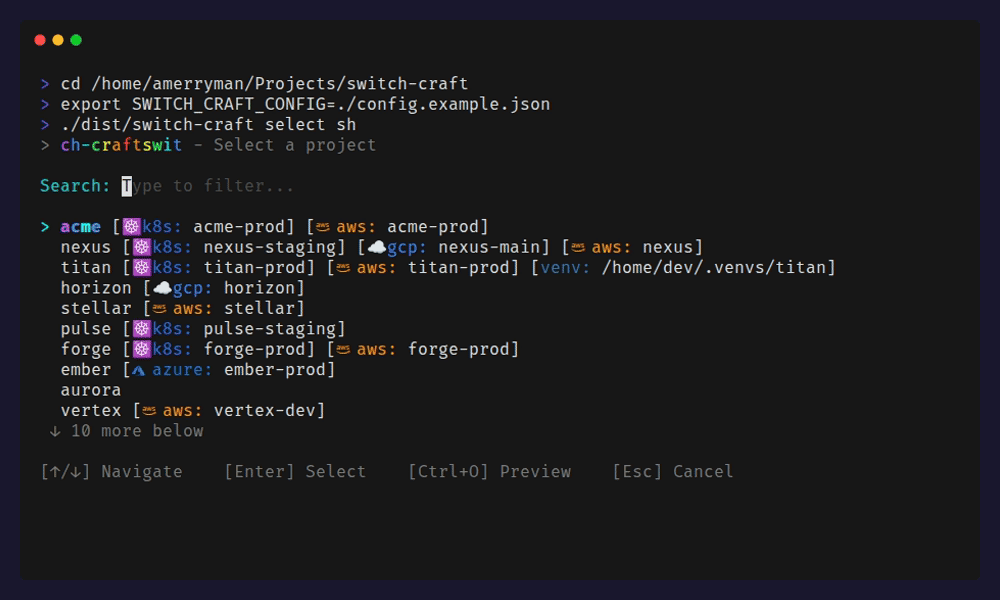

# switch-craft

A cross-shell project switcher with environment management. Effortlessly navigate between projects with a single command.



## Features

- **Fuzzy project search** - Find projects quickly with fuzzy matching
- **Environment management** - Automatically set kubectx, gcloud, AWS profiles, and more
- **Cross-shell support** - Works with Bash, Zsh, Fish, and PowerShell
- **Interactive selector** - Built-in fuzzy finder for project selection
- **Colorful output** - Rainbow ASCII banners and colored info tables
- **Reset command** - Clear all environment settings with one command

## Installation

### Prerequisites

- Node.js 18+
- yarn or npm

### Quick Install

```bash
# Clone the repository
git clone https://github.com/amerryma/switch-craft ~/Projects/switch-craft
cd ~/Projects/switch-craft

# Install and build
yarn install
yarn build
```

### Shell Integration

Add to your shell profile:

**Bash/Zsh:**
```bash
sc() { eval "$(node ~/Projects/switch-craft/dist/cli.js go sh "$@")"; }
scx() { eval "$(node ~/Projects/switch-craft/dist/cli.js select sh)"; }
scc() { eval "$(node ~/Projects/switch-craft/dist/cli.js reset sh)"; }
alias scl="node ~/Projects/switch-craft/dist/cli.js list"
```

**Fish:**
```fish
function sc; node ~/Projects/switch-craft/dist/cli.js go fish $argv | source; end
function scx; node ~/Projects/switch-craft/dist/cli.js select fish | source; end
function scc; node ~/Projects/switch-craft/dist/cli.js reset fish | source; end
function scl; node ~/Projects/switch-craft/dist/cli.js list; end
```

**PowerShell:**
```powershell
function sc { (& node ~/Projects/switch-craft/dist/cli.js go pwsh $args) | Invoke-Expression }
function scx { (& node ~/Projects/switch-craft/dist/cli.js select pwsh) | Invoke-Expression }
function scc { (& node ~/Projects/switch-craft/dist/cli.js reset pwsh) | Invoke-Expression }
function scl { & node ~/Projects/switch-craft/dist/cli.js list }
```

## Configuration

Create `~/.config/switch-craft/config.json`:

```json
{
  "projectsDir": "/home/user/Projects",
  "icons": {
    "k8s": "☸️",
    "gcp": "☁️",
    "aws": "󰸏",
    "azure": "󰠅",
    "venv": "",
    "path": ""
  },
  "projects": [
    {
      "name": "web",
      "path": "company/web",
      "env": { "NODE_ENV": "development" },
      "kubectx": "dev-cluster",
      "gcloud": "dev",
      "aws": "dev"
    },
    {
      "name": "api",
      "path": "company/api",
      "kubectx": "dev-cluster"
    },
    {
      "name": "scripts",
      "path": "personal/scripts",
      "venv": "/home/user/.venvs/scripts"
    }
  ]
}
```

### Custom Icons

The optional `icons` field allows you to customize the display labels for different service types. Icons will be shown in the interactive selector alongside the text labels. If not specified, only text labels (e.g., `k8s:`, `gcp:`) are shown.

### Environment Variables

| Variable | Description |
|----------|-------------|
| `SWITCH_CRAFT_CONFIG` | Path to config file (default: `~/.config/switch-craft/config.json`) |
| `SWITCH_CRAFT_PROJECTS_DIR` | Override base projects directory |

## Usage

### Commands

| Command | Description |
|---------|-------------|
| `sc <project>` | Switch to project with full environment setup |
| `scx` | Interactive fuzzy project selector |
| `scc` | Reset/clear environment and go to projects dir |
| `scl` | List all configured projects |

### Examples

```bash
# Switch to a project (fuzzy matching works!)
sc web
sc serv    # matches "servertron"

# Interactive selection
scx

# Reset environment
scc

# List projects
scl
```

### Project Properties

| Property | Description |
|----------|-------------|
| `name` | Project identifier (used for fuzzy search) |
| `path` | Directory path (relative to projectsDir or absolute) |
| `kubectx` | Kubernetes context to activate |
| `gcloud` | Google Cloud configuration name |
| `aws` | AWS profile name |
| `azure` | Azure account (placeholder) |
| `venv` | Python virtualenv path to activate |
| `env` | Custom environment variables to export |

## CLI Reference

```
switch-craft <command> [options] [args]

Commands:
  go <shell> <name>    Switch to project with full env setup
  reset <shell>        Reset environment and go to projects dir
  path <name>          Print the absolute path of a project
  list                 List all configured projects
  select <shell>       Interactive fuzzy project selector

Shells:
  sh      Bash/Zsh compatible output
  fish    Fish shell output
  pwsh    PowerShell output

Options:
  --no-env     Skip environment variable exports
  -h, --help   Show help
  -v, --version  Show version
```

## Legacy Support

If you're migrating from the old zsh-only version, you can create aliases for your old commands:

```bash
alias cdf="sc fathom"
alias cds="sc servertron"
alias cdx="scc"
```

## Recommended Tools

- [Spaceship Prompt](https://github.com/spaceship-prompt/spaceship-prompt) - Shows cloud/k8s context in prompt
- [kubectx](https://github.com/ahmetb/kubectx) - Kubernetes context switcher
- [gcloud CLI](https://cloud.google.com/sdk/gcloud) - Google Cloud SDK
- [AWS CLI](https://aws.amazon.com/cli/) - AWS command line interface

## License

MIT
