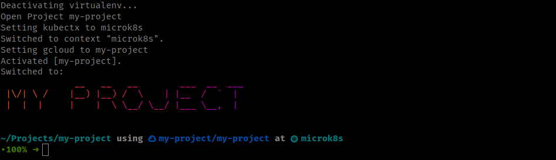
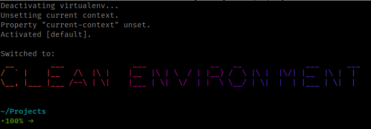

# switch-craft

Effortlessly navigate between projects with a single command.



## Oh My Zsh

1. Clone this repository into `$ZSH_CUSTOM/plugins` (by default `~/.oh-my-zsh/custom/plugins`)

    ```sh
    git clone https://github.com/amerryma/switch-craft ${ZSH_CUSTOM:-~/.oh-my-zsh/custom}/plugins/switch-craft
    ```

2. Add the plugin to the list of plugins for Oh My Zsh to load (inside `~/.zshrc`):

    ```sh
    plugins=( 
        # other plugins...
        switch-craft
    )
    ```

3. Start a new terminal session.

## Set Project Alias

The arguments are positional. Use quotes if you need to include spaces. If you need
to skip an argument, use "false".

```sh
alias cdp='switch_craft <project-display-name> <project-name> <kubectx> <gcloud> <enable-venv> <aws> <azure>'
```

To switch the default project dir of `~/Projects`, you can set the `SWITCH_CRAFT_PROJECTS_DIR` environment variable.

```sh
export SWITCH_CRAFT_PROJECTS_DIR=~/my-projects

# or per alias

alias cdp='SWITCH_CRAFT_PROJECTS_DIR=~/my-projects switch_craft <..args>'
```

## Supported Arguments

### Project Display Name

This is the name that will be displayed in the prompt. It can be anything you want.

### Project Name

This is the name of the directory that contains the project. It is relative to the `SWITCH_CRAFT_PROJECTS_DIR`
environment variable.

### Kubectx

If you have [kubectx](https://github.com/ahmetb/kubectx/) installed, you can set the third argument to the name of the
context you want to switch to a context name. You can list the available contexts with:

```sh
kubectx
```

### Gcloud

If you have [gcloud](https://cloud.google.com/sdk/gcloud) installed, you can set the fourth argument to the name of the
gcloud configuration you want to switch to. You can list the available configurations with:

```sh
gcloud config configurations list
```

### Virtualenv

If you have a virtualenv in your project, you can set the fifth argument to the relative path within the projects dir to
automatically activate the virtualenv that is a sibling of the current project. This could be useful for running python
applications while in a different directory.

This requires the zsh plugin called `autoswitch_virtualenv` which is
found [here](https://github.com/MichaelAquilina/zsh-autoswitch-virtualenv).

### AWS

If you have [aws](https://aws.amazon.com/cli/) installed, you can set the sixth argument to the name of the aws profile
you want to switch to. You can list the available profiles with:

```sh
aws configure list-profiles
```

### Azure

If you have [az](https://learn.microsoft.com/en-us/cli/azure/) installed, you can set the seventh argument to the name
of the azure profile you want to switch to. You can list the available profiles with:

```sh
az account list --output table
```

## Additional Dependencies

### figlet & lolcat

For more fun, you can install [figlet](http://www.figlet.org/) and [lolcat](https://github.com/busyloop/lolcat)

You will need to install `JS Stick Letters` font.

```sh
sudo curl -o /usr/share/figlet/JS\ Stick\ Letters.flf https://raw.githubusercontent.com/xero/figlet-fonts/master/JS%20Stick%20Letters.flf
```



### Spaceship Prompt

This plugin works well with the [Spaceship Prompt](https://github.com/spaceship-prompt/spaceship-prompt)
as it shows the different components in the prompt.
