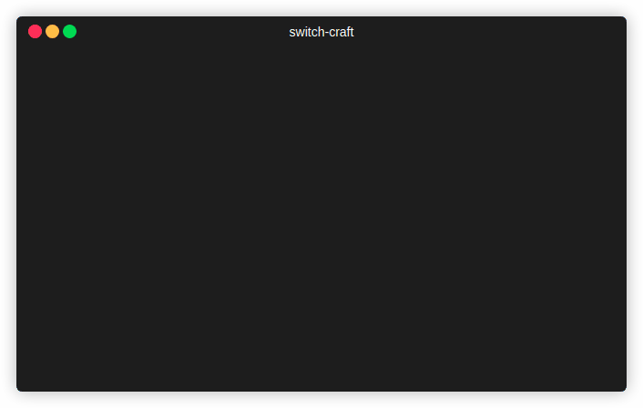

# switch-craft

A cross-shell project switcher with environment management. Effortlessly navigate between projects with a single command.



## Features

- **Fuzzy project search** - Find projects quickly with fuzzy matching
- **Environment management** - Automatically set kubectx, gcloud, AWS profiles, and more
- **Cross-shell support** - Works with Bash, Zsh, Fish, and PowerShell
- **Interactive selector** - Built-in fuzzy finder for project selection
- **Colorful output** - Rainbow ASCII banners and colored info tables
- **Command preview** - Press Ctrl+O to preview commands before switching
- **Reset command** - Clear all environment settings with one command

## Installation

### Prerequisites

- [Bun](https://bun.sh/) runtime

### Quick Install

```bash
# Clone the repository
git clone https://github.com/amerryma/switch-craft ~/Projects/switch-craft
cd ~/Projects/switch-craft

# Install and build
bun install
bun run build:local
```

### Shell Integration

Add to your shell profile:

**Bash/Zsh:**
```bash
sc() { eval "$(~/Projects/switch-craft/dist/switch-craft go sh "$@")"; }
scx() { eval "$(~/Projects/switch-craft/dist/switch-craft select sh)"; }
scc() { eval "$(~/Projects/switch-craft/dist/switch-craft reset sh)"; }
alias scl="~/Projects/switch-craft/dist/switch-craft list"
```

**Fish:**
```fish
function sc; ~/Projects/switch-craft/dist/switch-craft go fish $argv | source; end
function scx; ~/Projects/switch-craft/dist/switch-craft select fish | source; end
function scc; ~/Projects/switch-craft/dist/switch-craft reset fish | source; end
alias scl="~/Projects/switch-craft/dist/switch-craft list"
```

**PowerShell:**
```powershell
function sc { (& ~/Projects/switch-craft/dist/switch-craft go pwsh $args) | Invoke-Expression }
function scx { (& ~/Projects/switch-craft/dist/switch-craft select pwsh) | Invoke-Expression }
function scc { (& ~/Projects/switch-craft/dist/switch-craft reset pwsh) | Invoke-Expression }
function scl { & ~/Projects/switch-craft/dist/switch-craft list }
```

## Configuration

Create `~/.config/switch-craft/config.json`:

```json
{
  "projectsDir": "/home/user/projects",
  "icons": {
    "k8s": "☸️",
    "gcp": "☁️",
    "aws": "󰸏",
    "venv": ""
  },
  "projects": [
    {
      "name": "acme",
      "path": "clients/acme",
      "kubectx": "acme-prod",
      "aws": "acme-prod"
    },
    {
      "name": "nexus",
      "path": "clients/nexus",
      "gcloud": "nexus-main"
    },
    {
      "name": "internal",
      "path": "internal/tools"
    }
  ]
}
```

### Custom Icons

The optional `icons` field allows you to customize the display labels for different service types. Icons will be shown in the interactive selector alongside the text labels. If not specified, only text labels (e.g., `k8s:`, `gcp:`) are shown.

### Environment Variables

| Variable | Description |
|----------|-------------|
| `SWITCH_CRAFT_CONFIG` | Path to config file (default: `~/.config/switch-craft/config.json`) |
| `SWITCH_CRAFT_PROJECTS_DIR` | Override base projects directory |

## Usage

### Commands

| Command | Description |
|---------|-------------|
| `sc <project>` | Switch to project with full environment setup |
| `scx` | Interactive fuzzy project selector |
| `scc` | Reset/clear environment and go to projects dir |
| `scl` | List all configured projects |

### Interactive Controls

| Key | Action |
|-----|--------|
| `↑/↓` | Navigate project list |
| `Enter` | Select project |
| `Ctrl+O` | Toggle command preview |
| `Esc` | Cancel |

### Examples

```bash
# Switch to a project (fuzzy matching works!)
sc acme
sc nex    # matches "nexus"

# Interactive selection
scx

# Reset environment
scc

# List projects
scl
```

### Project Properties

| Property | Description |
|----------|-------------|
| `name` | Project identifier (used for fuzzy search) |
| `path` | Directory path (relative to projectsDir or absolute) |
| `kubectx` | Kubernetes context to activate |
| `gcloud` | Google Cloud configuration name |
| `aws` | AWS profile name |
| `azure` | Azure account |
| `venv` | Python virtualenv path to activate |
| `env` | Custom environment variables to export |

## CLI Reference

```
switch-craft <command> [options] [args]

Commands:
  go <shell> [name]    Switch to project (interactive if no name)
  reset <shell>        Reset environment and go to projects dir
  path [name]          Print project path (interactive if no name)
  list                 List all configured projects
  select <shell>       Interactive fuzzy project selector

Shells:
  sh      Bash/Zsh compatible output
  fish    Fish shell output
  pwsh    PowerShell output

Options:
  --no-env       Skip environment variable exports
  -h, --help     Show help
  -v, --version  Show version
```

## Recommended Tools

- [Spaceship Prompt](https://github.com/spaceship-prompt/spaceship-prompt) - Shows cloud/k8s context in prompt
- [kubectx](https://github.com/ahmetb/kubectx) - Kubernetes context switcher
- [gcloud CLI](https://cloud.google.com/sdk/gcloud) - Google Cloud SDK
- [AWS CLI](https://aws.amazon.com/cli/) - AWS command line interface

## Contributing

See [CONTRIBUTING.md](CONTRIBUTING.md) for development setup and how to generate the demo GIF.

## License

MIT
